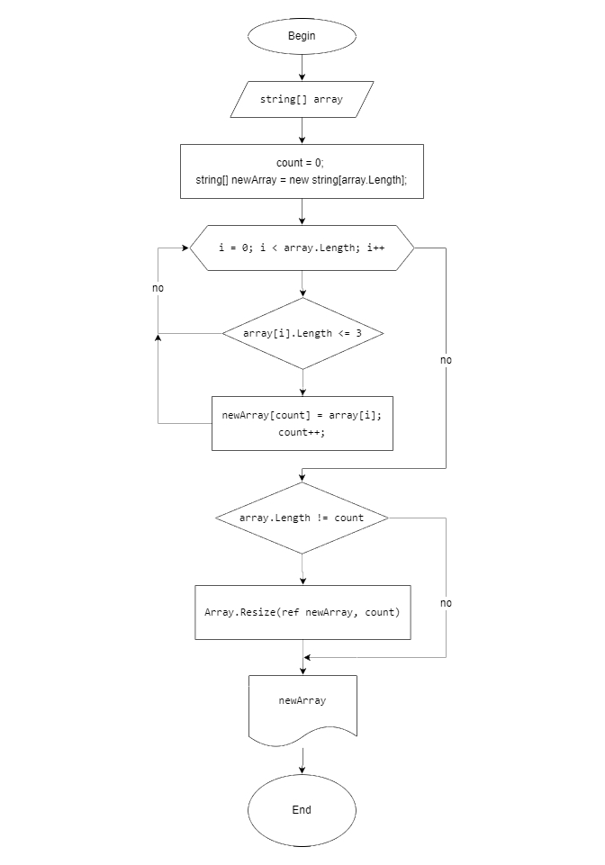

# Итоговая проверочная работа
**Задача.** *Написать программу, которая из имеющего массива строк формирует массив из строк, длина которых меньше либо равна 3 символам. Первоначальный массив можно ввести с клавиатуры, либо задать на старте выполнения алгоритма. При решении не рекомендуется пользоваться коллекциями, лучше обойтись исключительно массивами.*

**Решение.**
1. Создаем новый репозиторий
2. Создаем папку для работы с локальным репозиторием
3. Клонируем и соединяем пустой удаленный репозиторий с локальным
4. Подключаем файл .gitignore для обработки исключений и файл README.md для описания решения
5. Пишем код программы
3. Создаем блок-схему для основного метода программы
